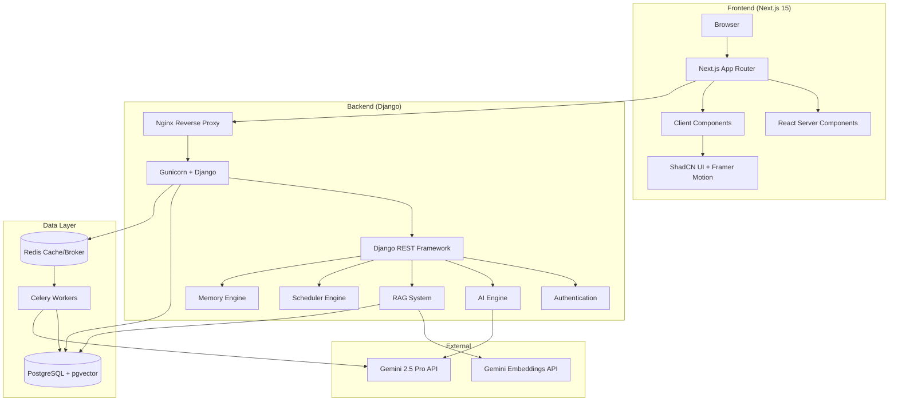
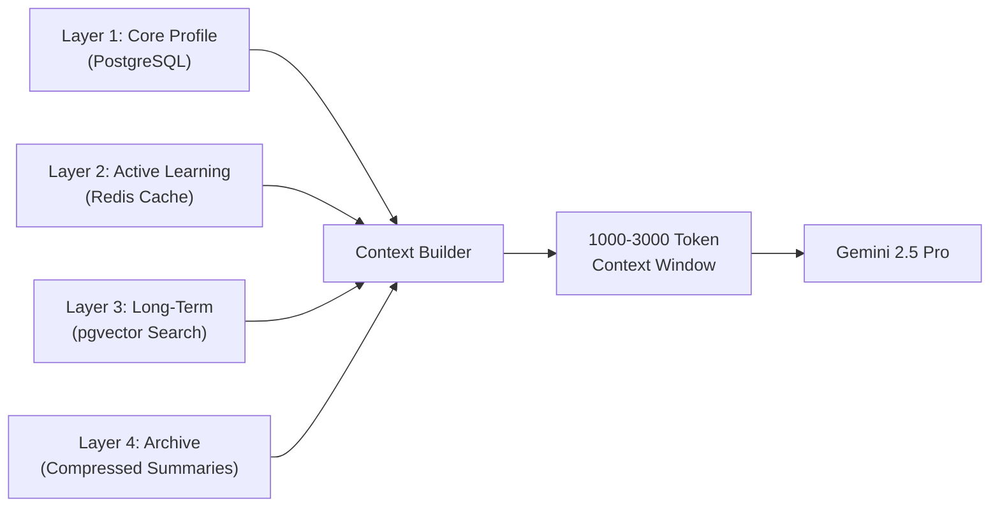
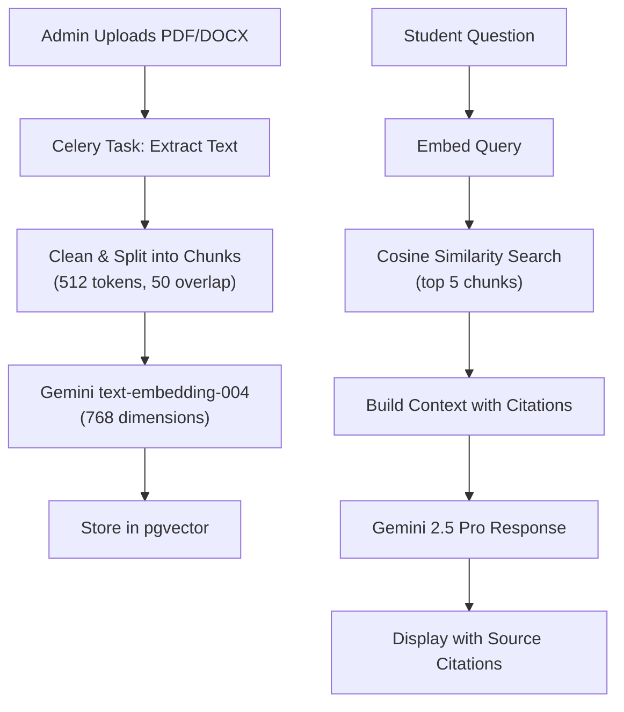

# Study Commander AI — Implementation Plan

> A personal AI-powered learning platform for a single CA Foundation student, built with Next.js 15 + Django + PostgreSQL/pgvector + Redis + Celery + Gemini 2.5 Pro.

---

## User Review Required

> [!IMPORTANT]
> **This is a massive system (~50+ database models, ~100+ API endpoints, ~40+ frontend pages).** Full production implementation will require multiple phases. Please review the phased approach below and confirm you'd like to proceed with **Phase 1** first, then we iterate.

> [!WARNING]
> **Gemini API Key Required.** You'll need a Google AI Studio API key for Gemini 2.5 Pro and `text-embedding-004`. Please have this ready before Phase 2.

> [!IMPORTANT]
> **Docker Required for Local Development.** PostgreSQL (with pgvector), Redis, and Celery all run inside Docker containers. Ensure Docker Desktop is installed on your machine.

---

## Open Questions

> [!IMPORTANT]
> 1. **Domain Name**: Do you already have a domain name for SSL setup? If not, what domain will you use?
> 2. **Google OAuth**: Do you have Google OAuth credentials (Client ID/Secret) for Google Login, or should I set up email/password only for now?
> 3. **Email Provider**: Which SMTP service will you use for email notifications? (Gmail SMTP, SendGrid, Mailgun, etc.)
> 4. **Hostinger VPS Specs**: Which VPS plan do you have? (2GB/4GB/8GB RAM) — this affects Docker resource limits and worker counts.
> 5. **Tailwind Version**: You specified Tailwind CSS — should I use **Tailwind v4** (latest) or **Tailwind v3** (stable with ShadCN)?

---

## Architecture Overview



---

## Complete Folder Structure

```
c:\Users\adars\Desktop\aI-ca\
├── backend/                          # Django Backend
│   ├── Dockerfile
│   ├── requirements.txt
│   ├── manage.py
│   ├── config/                       # Django Project Config
│   │   ├── __init__.py
│   │   ├── settings/
│   │   │   ├── __init__.py
│   │   │   ├── base.py              # Shared settings
│   │   │   ├── development.py       # Dev overrides
│   │   │   └── production.py        # Production overrides
│   │   ├── urls.py
│   │   ├── wsgi.py
│   │   ├── asgi.py
│   │   └── celery.py
│   ├── apps/
│   │   ├── accounts/                # Auth, Student Profile, JWT
│   │   │   ├── models.py
│   │   │   ├── serializers.py
│   │   │   ├── views.py
│   │   │   ├── urls.py
│   │   │   ├── admin.py
│   │   │   ├── signals.py
│   │   │   └── permissions.py
│   │   ├── memory/                  # Personal Memory Engine
│   │   │   ├── models.py           # All memory models
│   │   │   ├── services.py         # Memory retrieval/storage
│   │   │   ├── summarizer.py       # Memory summarization
│   │   │   ├── serializers.py
│   │   │   ├── views.py
│   │   │   ├── urls.py
│   │   │   └── admin.py
│   │   ├── knowledge/              # ICAI Knowledge Brain + RAG
│   │   │   ├── models.py           # Documents, Chunks, Embeddings
│   │   │   ├── pipeline.py         # Document processing pipeline
│   │   │   ├── retriever.py        # Vector search + RAG
│   │   │   ├── embeddings.py       # Gemini embedding service
│   │   │   ├── serializers.py
│   │   │   ├── views.py
│   │   │   ├── urls.py
│   │   │   ├── admin.py
│   │   │   └── tasks.py            # Celery tasks for processing
│   │   ├── curriculum/             # Subjects, Chapters, Topics
│   │   │   ├── models.py
│   │   │   ├── serializers.py
│   │   │   ├── views.py
│   │   │   ├── urls.py
│   │   │   └── admin.py
│   │   ├── ai_engine/              # Gemini Integration, Teaching
│   │   │   ├── models.py           # PromptTemplate, AISettings
│   │   │   ├── teacher.py          # AI Teacher Engine
│   │   │   ├── prompts.py          # Prompt builder with memory
│   │   │   ├── gemini_client.py    # Gemini API client
│   │   │   ├── adaptive.py         # Adaptive learning logic
│   │   │   ├── serializers.py
│   │   │   ├── views.py
│   │   │   ├── urls.py
│   │   │   └── admin.py
│   │   ├── scheduler/              # Study Plans, Tasks, Calendar
│   │   │   ├── models.py
│   │   │   ├── planner.py          # AI-powered schedule generation
│   │   │   ├── serializers.py
│   │   │   ├── views.py
│   │   │   ├── urls.py
│   │   │   ├── admin.py
│   │   │   └── tasks.py            # Celery periodic tasks
│   │   ├── assessment/             # MCQ, Mock Tests, Scoring
│   │   │   ├── models.py
│   │   │   ├── generator.py        # AI MCQ generation
│   │   │   ├── analyzer.py         # Score analysis
│   │   │   ├── serializers.py
│   │   │   ├── views.py
│   │   │   ├── urls.py
│   │   │   └── admin.py
│   │   ├── revision/               # Spaced Repetition Engine
│   │   │   ├── models.py
│   │   │   ├── sm2.py              # SM-2 algorithm implementation
│   │   │   ├── serializers.py
│   │   │   ├── views.py
│   │   │   ├── urls.py
│   │   │   ├── admin.py
│   │   │   └── tasks.py            # Celery: schedule revisions
│   │   ├── analytics/              # Charts, Scores, Predictions
│   │   │   ├── models.py
│   │   │   ├── calculator.py       # Readiness, risk scores
│   │   │   ├── serializers.py
│   │   │   ├── views.py
│   │   │   ├── urls.py
│   │   │   └── admin.py
│   │   ├── accountability/         # Check-ins, Streaks, Discipline
│   │   │   ├── models.py
│   │   │   ├── serializers.py
│   │   │   ├── views.py
│   │   │   ├── urls.py
│   │   │   └── admin.py
│   │   └── notifications/          # Email + In-App notifications
│   │       ├── models.py
│   │       ├── sender.py
│   │       ├── serializers.py
│   │       ├── views.py
│   │       ├── urls.py
│   │       ├── admin.py
│   │       └── tasks.py            # Celery: send notifications
│   └── utils/                      # Shared utilities
│       ├── pagination.py
│       ├── throttling.py
│       └── helpers.py
│
├── frontend/                        # Next.js 15 Frontend
│   ├── Dockerfile
│   ├── package.json
│   ├── next.config.ts
│   ├── tsconfig.json
│   ├── tailwind.config.ts
│   ├── components.json              # ShadCN config
│   ├── src/
│   │   ├── app/
│   │   │   ├── layout.tsx           # Root layout + providers
│   │   │   ├── page.tsx             # Landing/redirect
│   │   │   ├── (auth)/
│   │   │   │   ├── login/page.tsx
│   │   │   │   └── onboarding/page.tsx
│   │   │   ├── (dashboard)/
│   │   │   │   ├── layout.tsx       # Dashboard shell
│   │   │   │   ├── page.tsx         # Command Center
│   │   │   │   ├── learn/
│   │   │   │   │   ├── page.tsx     # Subject list
│   │   │   │   │   └── [subjectId]/
│   │   │   │   │       ├── page.tsx # Chapter list
│   │   │   │   │       └── [chapterId]/
│   │   │   │   │           └── page.tsx  # AI Teacher
│   │   │   │   ├── chat/page.tsx    # AI Chat/Voice
│   │   │   │   ├── revision/page.tsx
│   │   │   │   ├── schedule/page.tsx
│   │   │   │   ├── mcq/page.tsx
│   │   │   │   ├── mock-test/
│   │   │   │   │   ├── page.tsx
│   │   │   │   │   └── [testId]/page.tsx
│   │   │   │   ├── analytics/page.tsx
│   │   │   │   ├── library/page.tsx
│   │   │   │   ├── checkin/page.tsx
│   │   │   │   └── settings/page.tsx
│   │   │   └── globals.css
│   │   ├── components/
│   │   │   ├── ui/                  # ShadCN components
│   │   │   ├── layout/
│   │   │   │   ├── sidebar.tsx
│   │   │   │   ├── header.tsx
│   │   │   │   └── mobile-nav.tsx
│   │   │   ├── dashboard/
│   │   │   ├── learn/
│   │   │   ├── chat/
│   │   │   ├── revision/
│   │   │   ├── schedule/
│   │   │   ├── assessment/
│   │   │   ├── analytics/
│   │   │   └── common/
│   │   ├── lib/
│   │   │   ├── api.ts               # Axios/fetch client
│   │   │   ├── auth.ts              # Auth utilities
│   │   │   ├── utils.ts             # CN utility
│   │   │   └── constants.ts
│   │   ├── services/                # API service layer
│   │   │   ├── auth.service.ts
│   │   │   ├── memory.service.ts
│   │   │   ├── knowledge.service.ts
│   │   │   ├── curriculum.service.ts
│   │   │   ├── ai.service.ts
│   │   │   ├── scheduler.service.ts
│   │   │   ├── assessment.service.ts
│   │   │   ├── revision.service.ts
│   │   │   ├── analytics.service.ts
│   │   │   └── notification.service.ts
│   │   ├── hooks/                   # Custom React hooks
│   │   │   ├── use-auth.ts
│   │   │   ├── use-theme.ts
│   │   │   ├── use-voice.ts
│   │   │   └── use-debounce.ts
│   │   ├── types/                   # TypeScript types
│   │   │   ├── auth.types.ts
│   │   │   ├── curriculum.types.ts
│   │   │   ├── memory.types.ts
│   │   │   ├── assessment.types.ts
│   │   │   └── analytics.types.ts
│   │   ├── providers/
│   │   │   ├── query-provider.tsx    # React Query
│   │   │   ├── theme-provider.tsx
│   │   │   └── auth-provider.tsx
│   │   └── stores/                  # Client state (Zustand)
│   │       └── ui-store.ts
│   └── public/
│       ├── icons/
│       └── images/
│
├── docker-compose.yml               # All services
├── docker-compose.prod.yml          # Production overrides
├── nginx/
│   ├── nginx.conf                   # Development
│   └── nginx.prod.conf              # Production with SSL
├── scripts/
│   ├── deploy.sh                    # VPS deployment script
│   ├── backup.sh                    # Database backup
│   ├── restore.sh                   # Database restore
│   ├── ssl-setup.sh                 # Let's Encrypt SSL
│   └── init-db.sh                   # Initialize database
├── docs/
│   └── deployment-guide.md          # Hostinger VPS guide
├── .env.example                     # Environment template
├── .gitignore
└── README.md
```

---

## Phased Implementation Approach

### Phase 1: Foundation & Core Infrastructure
**Estimated files: ~80 | Goal: Get the system running end-to-end**

#### Backend Foundation
- [NEW] Django project with split settings (base/dev/prod)
- [NEW] Accounts app — Student model, JWT auth (simplejwt), login API
- [NEW] Curriculum app — Subject, Chapter, Topic models + admin
- [NEW] Memory app — Core memory models (profile, learning, behavior)
- [NEW] Docker setup — PostgreSQL + pgvector, Redis, Django, Celery

#### Frontend Foundation
- [NEW] Next.js 15 project with TypeScript, Tailwind, ShadCN UI
- [NEW] Auth flow — Login page, JWT token management
- [NEW] Onboarding flow — Multi-step student profile setup
- [NEW] Dashboard shell — Sidebar, header, theme toggle
- [NEW] Command Center — Today's schedule, stats overview

#### Infrastructure
- [NEW] `docker-compose.yml` with all services
- [NEW] Nginx reverse proxy config
- [NEW] Environment variable template

---

### Phase 2: ICAI Knowledge Brain & RAG
**Estimated files: ~30 | Goal: Upload documents, build knowledge base, AI answers from ICAI content**

#### Knowledge App
- [NEW] Document models (KnowledgeDocument, DocumentChunk, etc.)
- [NEW] Document processing pipeline (PDF/DOCX → chunks → embeddings)
- [NEW] pgvector integration with Gemini `text-embedding-004`
- [NEW] RAG retriever — vector search + context builder
- [NEW] Celery tasks for async document processing
- [NEW] Django Admin for document uploads

#### AI Engine
- [NEW] Gemini 2.5 Pro client with streaming
- [NEW] Prompt builder with memory context injection
- [NEW] Citation system — track which documents sourced the answer

#### Frontend
- [NEW] Knowledge Library page — view uploaded materials
- [NEW] AI Chat page — ask questions, get ICAI-sourced answers
- [NEW] Citation display — show sources for each answer

---

### Phase 3: AI Teacher & Adaptive Learning
**Estimated files: ~25 | Goal: Concept-by-concept teaching with adaptation**

- [NEW] AI Teacher Engine — 9-step teaching flow
- [NEW] Adaptive learning service — track what works
- [NEW] Understanding verification system
- [NEW] Learning style detection
- [NEW] Subject/Chapter/Concept memory tracking

#### Frontend
- [NEW] Learn page — subject → chapter → topic flow
- [NEW] AI Teacher UI — step-by-step teaching interface
- [NEW] Understanding check UI

---

### Phase 4: Scheduler & Accountability
**Estimated files: ~25 | Goal: Study plans, drag-drop scheduling, daily check-ins**

- [NEW] Study plan generator (AI-powered)
- [NEW] Daily/Weekly/Monthly schedule models
- [NEW] Drag-and-drop task management
- [NEW] Daily check-in system
- [NEW] Streak & discipline tracking
- [NEW] Recovery/catch-up plan generation

#### Frontend
- [NEW] Schedule page — interactive calendar with drag-drop
- [NEW] Check-in page — daily accountability form
- [NEW] Plan templates selector

---

### Phase 5: Assessment Engine
**Estimated files: ~25 | Goal: MCQ generation, mock tests, scoring**

- [NEW] AI-powered MCQ generation (Easy/Medium/Hard)
- [NEW] Mock test engine — subject & full-syllabus tests
- [NEW] Scoring & analysis system
- [NEW] Mistake tracking integration

#### Frontend
- [NEW] MCQ page — practice mode
- [NEW] Mock test page — exam simulation
- [NEW] Results & analysis UI

---

### Phase 6: Revision Engine
**Estimated files: ~15 | Goal: Spaced repetition with SM-2 algorithm**

- [NEW] SM-2 algorithm implementation
- [NEW] Auto-scheduled revisions (Day 1, 3, 7, 15, 30)
- [NEW] Revision task integration with scheduler
- [NEW] Forgetting risk calculator

#### Frontend
- [NEW] Revision page — due items, flashcard-style review

---

### Phase 7: Voice AI & Analytics
**Estimated files: ~20 | Goal: Voice conversations, charts, success prediction**

- [NEW] Voice AI — Browser Speech Recognition + TTS
- [NEW] Gemini Live API integration (WebSocket streaming)
- [NEW] Analytics calculator — readiness, risk, pass probability
- [NEW] Exam intelligence — question probability, topic importance

#### Frontend
- [NEW] Voice chat UI — microphone, waveform, responses
- [NEW] Analytics dashboard — Recharts visualizations
- [NEW] Success prediction display

---

### Phase 8: Notifications & Polish
**Estimated files: ~15 | Goal: Email/in-app notifications, settings**

- [NEW] Notification system — email + in-app
- [NEW] Notification templates (admin-editable)
- [NEW] Student settings page
- [NEW] Activity logs

---

### Phase 9: Production Deployment
**Estimated files: ~15 | Goal: Docker production build, VPS deployment**

- [NEW] Production Dockerfiles (multi-stage builds)
- [NEW] `docker-compose.prod.yml`
- [NEW] Nginx production config with SSL
- [NEW] Backup/restore scripts
- [NEW] Hostinger VPS deployment guide
- [NEW] Security hardening (rate limiting, CORS, CSP)

---

## Database Schema (Key Models)

### Accounts App
| Model | Key Fields |
|-------|-----------|
| `StudentProfile` | user (OneToOne), preferred_name, exam_attempt, exam_date, daily_study_hours, preferred_language, preferred_study_time, strong_subjects, weak_subjects |
| `StudentPreference` | theme, voice_enabled, notification_email, notification_inapp |
| `ActivityLog` | action, details, ip_address, device, timestamp |

### Memory App
| Model | Key Fields |
|-------|-----------|
| `LearningPreference` | learning_style, explanation_style, attention_span, understanding_speed, favorite_examples |
| `BehaviorProfile` | consistency_score, discipline_score, procrastination_patterns, productive_hours |
| `SubjectMemory` | subject (FK), strength_score, weakness_score, confidence_score |
| `ChapterMemory` | chapter (FK), understanding_score, revision_count, forgetting_risk, completion_pct |
| `ConceptMemory` | topic (FK), accuracy, mistakes_count, retention_score, last_reviewed |
| `MistakeMemory` | concept (FK), mistake_type (conceptual/repeated/careless), question_text, student_answer, correct_answer |
| `MemorySummary` | period (daily/weekly/monthly), summary_text, key_insights, created_at |

### Knowledge App
| Model | Key Fields |
|-------|-----------|
| `KnowledgeDocument` | title, doc_type (ICAI/RTP/MTP/PYQ/notes), subject (FK), file, status (processing/ready/error), page_count |
| `DocumentChunk` | document (FK), content, chunk_index, embedding (VectorField 768), chapter (FK nullable), topic (FK nullable) |
| `KnowledgeCitation` | chunk (FK), ai_response_id, relevance_score |
| `PreviousYearQuestion` | question_text, answer_text, year, subject (FK), chapter (FK), frequency_score |
| `RTPDocument` / `MTPDocument` | document (FK), year, session, analysis_json |

### Curriculum App
| Model | Key Fields |
|-------|-----------|
| `Subject` | name, code, order, is_active |
| `Chapter` | subject (FK), name, order, weightage, is_active |
| `Topic` | chapter (FK), name, order, importance_score |

### Scheduler App
| Model | Key Fields |
|-------|-----------|
| `StudyTask` | title, task_type, subject (FK), chapter (FK), scheduled_date, scheduled_time, duration_minutes, status, priority, is_completed |
| `DailySchedule` | date, tasks (M2M), hours_planned, hours_completed, notes |
| `WeeklySchedule` / `MonthlySchedule` | start_date, end_date, goals, review_notes |
| `Attendance` | date, hours_studied, is_present, check_in_time, check_out_time |

### Assessment App
| Model | Key Fields |
|-------|-----------|
| `MockTest` | title, test_type (subject/full), subject (FK nullable), duration_minutes, total_marks, is_published |
| `MockQuestion` | test (FK), question_text, options (JSON), correct_answer, difficulty, explanation, chapter (FK) |
| `MockResult` | test (FK), score, total, accuracy_pct, time_taken, analysis_json |
| `MCQAttempt` | question (FK), selected_answer, is_correct, time_taken, created_at |

### Revision App
| Model | Key Fields |
|-------|-----------|
| `RevisionTask` | topic (FK), due_date, interval_days, easiness_factor, repetitions, quality_score, is_completed |

### AI Engine App
| Model | Key Fields |
|-------|-----------|
| `PromptTemplate` | name, template_text, category (teaching/revision/mcq/analysis), is_active |
| `AISettings` | model_name, temperature, max_tokens, memory_token_limit |
| `SuccessPrediction` | readiness_score, pass_probability, risk_score, subject_risks (JSON), computed_at |

### Notifications App
| Model | Key Fields |
|-------|-----------|
| `Notification` | title, message, notification_type, is_read, is_email_sent, created_at |

---

## Key Technical Decisions

### Memory Architecture (4-Layer)



- **Layer 1 (Core Profile)**: Always included. Name, exam date, preferences (~200 tokens)
- **Layer 2 (Active Learning)**: Redis-cached recent session data. Current subject focus, recent mistakes (~500 tokens)
- **Layer 3 (Long-Term)**: pgvector similarity search on past interactions. Retrieved only when relevant (~1000 tokens)
- **Layer 4 (Archive)**: Monthly/weekly summaries. Compressed history, never raw data (~500 tokens)

### RAG Pipeline



### Embedding Dimensions
Using `text-embedding-004` with `output_dimensionality=768` (reduced from 3072) to optimize storage and search speed on smaller VPS instances while maintaining quality.

### JWT Auth Flow
```
Login → Access Token (15 min) + Refresh Token (7 days)
→ Access token in memory (not localStorage)
→ Refresh token in httpOnly cookie
→ Silent refresh on 401
```

---

## API Endpoints Overview

### Auth (`/api/auth/`)
| Method | Endpoint | Description |
|--------|----------|-------------|
| POST | `/login/` | Email/password login |
| POST | `/google/` | Google OAuth login |
| POST | `/token/refresh/` | Refresh JWT |
| POST | `/logout/` | Invalidate tokens |
| GET | `/profile/` | Get student profile |
| PATCH | `/profile/` | Update student profile |
| POST | `/onboarding/` | Complete onboarding |

### Curriculum (`/api/curriculum/`)
| Method | Endpoint | Description |
|--------|----------|-------------|
| GET | `/subjects/` | List subjects |
| GET | `/subjects/{id}/chapters/` | List chapters |
| GET | `/chapters/{id}/topics/` | List topics |

### AI (`/api/ai/`)
| Method | Endpoint | Description |
|--------|----------|-------------|
| POST | `/chat/` | AI chat with RAG |
| POST | `/teach/` | Start teaching session |
| POST | `/teach/verify/` | Verify understanding |
| POST | `/voice/` | Voice interaction |
| GET | `/suggestions/` | Get study suggestions |

### Knowledge (`/api/knowledge/`)
| Method | Endpoint | Description |
|--------|----------|-------------|
| GET | `/documents/` | List uploaded documents |
| POST | `/documents/upload/` | Upload document (admin) |
| GET | `/documents/{id}/` | Document detail |
| GET | `/search/` | Semantic search |

### Schedule (`/api/schedule/`)
| Method | Endpoint | Description |
|--------|----------|-------------|
| GET | `/today/` | Today's schedule |
| GET | `/weekly/` | Weekly schedule |
| POST | `/tasks/` | Create task |
| PATCH | `/tasks/{id}/` | Update/move task |
| POST | `/tasks/{id}/complete/` | Mark complete |
| POST | `/generate/` | AI generate schedule |

### Assessment (`/api/assessment/`)
| Method | Endpoint | Description |
|--------|----------|-------------|
| POST | `/mcq/generate/` | Generate MCQs |
| POST | `/mcq/submit/` | Submit MCQ answer |
| GET | `/mock-tests/` | List mock tests |
| POST | `/mock-tests/{id}/start/` | Start test |
| POST | `/mock-tests/{id}/submit/` | Submit test |
| GET | `/mock-tests/{id}/results/` | Get results |

### Revision (`/api/revision/`)
| Method | Endpoint | Description |
|--------|----------|-------------|
| GET | `/due/` | Due revisions |
| POST | `/complete/` | Complete revision |
| GET | `/schedule/` | Revision calendar |

### Analytics (`/api/analytics/`)
| Method | Endpoint | Description |
|--------|----------|-------------|
| GET | `/dashboard/` | Dashboard stats |
| GET | `/study-hours/` | Study hours chart data |
| GET | `/subject-progress/` | Subject progress |
| GET | `/readiness/` | Exam readiness |
| GET | `/predictions/` | Success predictions |

### Accountability (`/api/accountability/`)
| Method | Endpoint | Description |
|--------|----------|-------------|
| POST | `/checkin/` | Daily check-in |
| GET | `/streak/` | Current streak |
| GET | `/discipline/` | Discipline score |

---

## Verification Plan

### Automated Tests
```bash
# Backend tests
docker compose exec backend python manage.py test

# Frontend lint & type check
cd frontend && npm run lint && npx tsc --noEmit

# Full integration test
docker compose up --build
```

### Manual Verification
1. Login flow works (email + password)
2. Onboarding saves student profile
3. Dashboard loads with correct data
4. Document upload triggers processing pipeline
5. AI chat returns ICAI-sourced answers with citations
6. Schedule drag-and-drop works
7. MCQ generation and scoring works
8. Theme toggle (dark/light) persists
9. Docker production build runs cleanly
10. VPS deployment guide is followed successfully

---

## Resource Optimization (2GB VPS)

| Service | Memory Allocation |
|---------|------------------|
| PostgreSQL | 512 MB |
| Redis | 128 MB |
| Django + Gunicorn (2 workers) | 512 MB |
| Celery (1 worker, 2 threads) | 256 MB |
| Next.js (standalone build) | 256 MB |
| Nginx | 64 MB |
| OS overhead | 256 MB |
| **Total** | **~2 GB** |

For 4GB+ VPS: Scale Gunicorn to 4 workers, Celery to 2 workers.

---

## Execution Plan

I will build this system **phase by phase**, starting with **Phase 1 (Foundation & Core Infrastructure)**, which includes:

1. Complete Django backend setup with all core apps and models
2. Complete Next.js frontend with auth, onboarding, and dashboard
3. Docker Compose with PostgreSQL+pgvector, Redis
4. Premium dark/light theme with ShadCN UI

**Please review and approve to begin Phase 1 implementation.**
